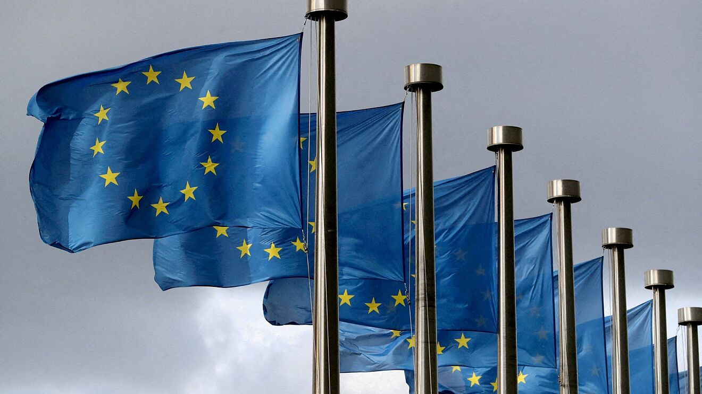
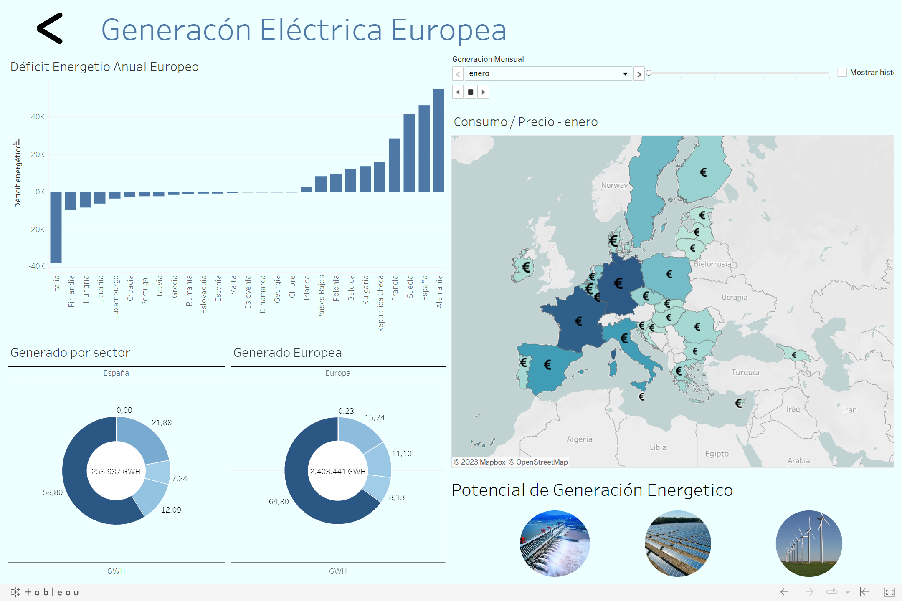

# Proyecto_Energy_Tableau
---

Podermos ver muchas cosa que pueden interesar a una persona, como la utilización de la enregias renovables y la dependencia de las no renovables, el consumo de enrgía de cada pais, el precio de la luz, o la relación del gas con este. Todos eso datos se encuentran el el proyecto de Tableau: [**European_Energy**](https://public.tableau.com/views/Proyecto_T_16763093826450/Energa_Europea?:language=es-ES&:display_count=n&:origin=viz_share_link)

# Motivación
---

El principal motivo para hacer una este proyecto sobre la energía en los Países miembros de la Unión Europea, era debido, al incremento de los precios de esta. No obstante, a la hora de recopilar datos, las principales [entidades](https://ec.europa.eu/eurostat) encargadas de recopilar y hacer informes energéticos de la Unión Europea, no tenían los datos del precio del gas del segundo semestre del 2022 los cual nos ayudaría a saber si la ‘Excepción Ibérica’ estaba funcionando, así que decidí centrarme en otro ámbito, en este caso seria las energías renovables puesto que el cambio climático es un tema que atañe a todos, por lo cual deberíamos reflexionar sobre la dependencia de nuestros países a las fuentes de energía no renovables y ver si estamos aprovechando todo lo posible las fuentes de energías renovables.

# Secciones
---

El Dashboard consta de dos ramas principales la energía generada y el consumo de energía, en la parte de la energía generada se podrán ver tres opciones más, correspondientes a el potencial energético de los Países miembros de la Unión Europea. 

**Dashboards:**
- Portada: Se encontrara una portada con dos botones de navegación, uno que te llevara a el Dashboard de Generado y el otro al de Consumo.

- Generado: En este se podrá ver cuatro gráfica, una con el déficit energético de los países de la Unión Europea, un mapa con estos Países, una gráfica circular con los porcentajes de generación de energías renovables del país seleccionado en el mapa  y otra circular con el conjunto de Europa. También encontrara tes botones de navegación, los cuales le podrán llevar a otros Dashboards que corresponden al aprovechamiento de las energía hidráulica, solar y eólica.

	- Hidráulica, Solar y Eólica:
	Consta de un mapa para seleccionar el país que dese, el porcentaje de aprovechamiento de ese país, el PIB, la renta per cápita y lo generado y el potencial generador, también tiene una gráfica con los valores  de generación y potencial de todos los países de la Unión Europea.(El formato es el mismo, solo cambia los valores de salida dependiendo de la fuente de energía que se desea ver).
- Consumido: Por último en el Dashboard de consumo podrás encontrar tres graficas un mapa con los Países miembros de la Unión Europea para seleccionar el que quieres ver, un histograma con el precio medio que pagaría un habitante de dicho país por la factura de la luz en cada mes y un grafico con la comparativa de precios entre el gas y el precio de la electricidad.

---

